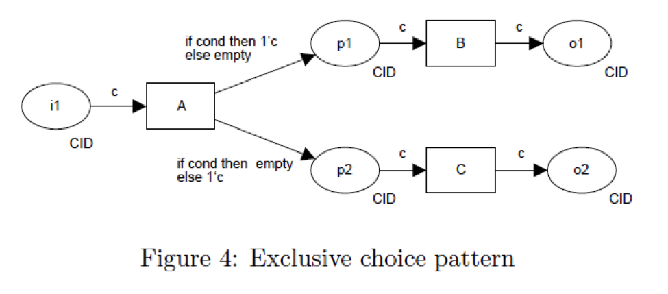

.. _exclusive-choice-simple-merge:

===============================
Exclusive Choice / Simple Merge
===============================

Use Case
========

User makes a definitive choice between multiple branches and only completes
tasks in that branch. When the merge point is reached, flow continues
immediately past the merge point to the next task.

BPMN Diagram
============

.. image:: pics/exclusive-choice-simple-merge.png

Patterns
========

Exclusive Choice Pattern

Simple Merge Pattern

.. image:: pics/pattern5.png

Demos
=====

Upper Branch
~~~~~~~~~~~~

* Logging Task 1: First
* Choice 1: A
* Logging Task 2: Middle 
* Logging Task 4: End

Lower Branch
~~~~~~~~~~~~

* Logging Task 1: First
* Choice 1: B
* Logging Task 3: Middle 
* Logging Task 4: End

Can't Do Both Branches
~~~~~~~~~~~~~~~~~~~~~~

* Logging Task 1: First
* Choice 1: A B
* Logging Task 2: Middle 
* Logging Task 4: End

Next Demo
=========

* :ref:`multichoice-structured-synchronization`
