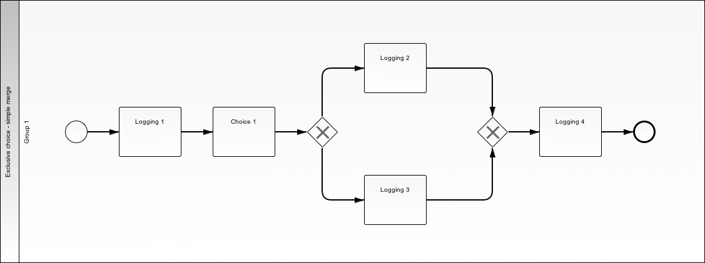
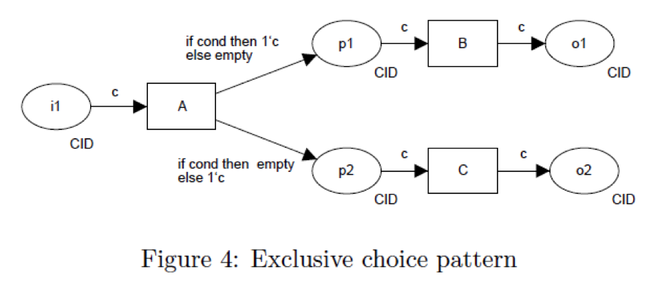
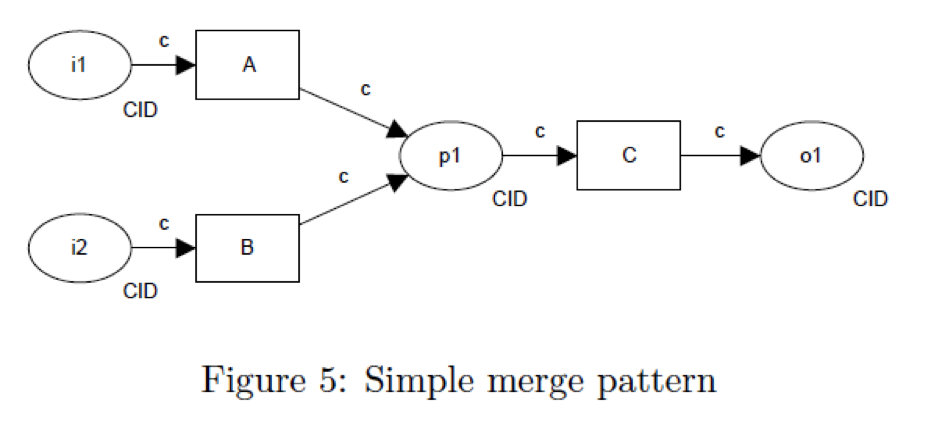

.. _exclusive-choice-simple-merge2:

===============================
Exclusive Choice / Simple Merge
===============================

Use Case
========

User makes a definitive choice between multiple branches and only completes
tasks in that branch. When the merge point is reached, flow continues
immediately past the merge point to the next task.

BPMN Diagram
============

Patterns
========

Exclusive Choice Pattern

Simple Merge Pattern

Demos
=====

Setup
~~~~~

* http://localhost:8000/client/1/exclusive_choice_simple_merge

Procedure
~~~~~~~~~
Upper Branch
------------

* Logging Task 1: Hello
* Choice 1: A
* Logging Task 2: World
* Logging Task 4: War Three
* Submit

Lower Branch
------------

* Logging Task 1: Hello
* Choice 1: B
* Logging Task 3: World
* Logging Task 4: War Three
* Submit

Can't Do Both Branches
----------------------

* Logging Task 1: Hellow
* Choice 1: A B
* Logging Task 2: World 
* Logging Task 4: War Three

Next Demo
=========

* :ref:`multichoice-structured-synchronization`
