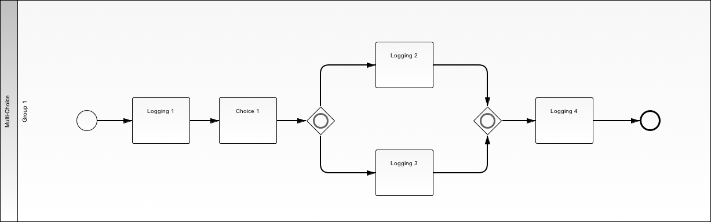

.. _multichoice-structured-synchronization:

=========================================
Multi Choice / Structured Synchronization
=========================================

Use Case
========

User selects one or more branches and only completes tasks in the selected
branches. When the merge point is reached for a given branch, flow is moved
to any incomplete branches until all seleted branches are complete. and which
time the flow continues past the merge point to the next task.

BPMN Diagram
============

Patterns
========

Exclusive Choice Pattern

.. image:: pics/pattern6.png

Structured Synchronization Pattern

.. image:: pics/pattern3.png

Demos
=====

Setup
~~~~~

* ``./manage.py run_demo user1 mult_choice``

Procedure
~~~~~~~~~

Upper Branch
------------

* Logging Task 1: First
* Choice 1: A
* Logging Task 2: Middle 
* Logging Task 4: End
* y

Lower Branch
------------

* Logging Task 1: First
* Choice 1: B
* Logging Task 3: Middle 
* Logging Task 4: End

Both Branches
-------------

* Logging Task 1: First
* Choice 1: A B
* Logging Task 2: Upper Middle
* Logging Task 3: Lower Middle
* Logging Task 4: End
* n

First Demo
==========

* :ref:`sequence`
