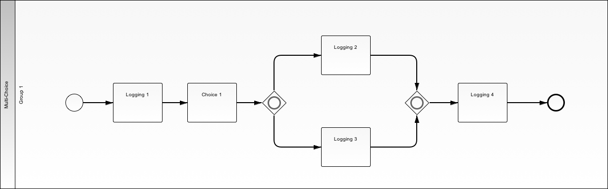
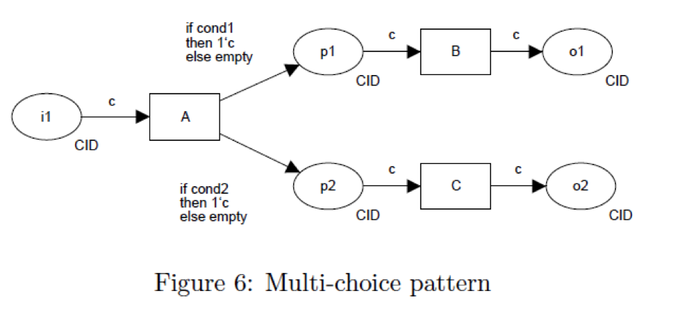
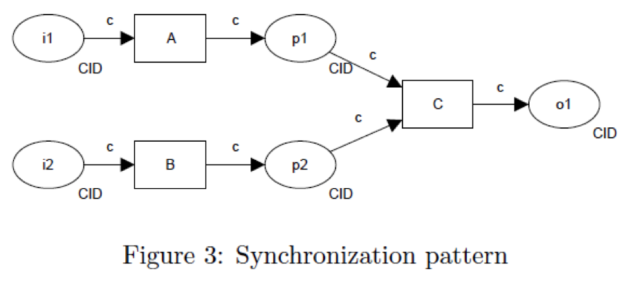

.. _multichoice-structured-synchronization2:

=========================================
Multi Choice / Structured Synchronization
=========================================

Use Case
========

User selects one or more branches and only completes tasks in the selected
branches. When the merge point is reached for a given branch, flow is moved
to any incomplete branches until all seleted branches are complete. and which
time the flow continues past the merge point to the next task.

BPMN Diagram
============

Patterns
========

Exclusive Choice Pattern

Structured Synchronization Pattern

Demos
=====

Setup
~~~~~

* http://localhost:8000/client/1/multi_choice

Procedure
~~~~~~~~~

Upper Branch
------------

* Logging Task 1: Hello
* Choice 1: A
* Logging Task 2: World
* Logging Task 4: War Three
* Submit

Lower Branch
------------

* Logging Task 1: Hello
* Choice 1: B
* Logging Task 3: World
* Logging Task 4: War Three
* Submit

Both Branches
-------------

* Logging Task 1: Hello
* Choice 1: A B
* Logging Task 2: World
* Logging Task 3: War Three
* Logging Task 4: Zombie

First Demo
==========

* :ref:`parallel-split-synchronization`
