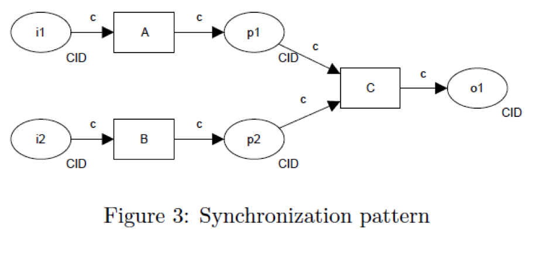

.. _parallel-split-synchronization:

================================
Parallel Split / Synchronization
================================

Use Case
========

A portion of the workflow must be completed by a different user. Work by
original user can continue while awaiting completion by the second user.

Workflow stops at the merge point until all branches are completed. Once
the merge point has been reached by branches, flow continues.
tasks in that branch. When the merge point is reached, flow continues past
the merge point.

BPMN Diagram
============

.. image:: pics/parallel-split-synchronization.png

Patterns
========

Exclusive Choice Pattern

Synchronization Pattern

Demos
=====

User 1 Completes Tasks First
~~~~~~~~~~~~~~~~~~~~~~~~~~~~

* User 1

    - Logging Task 1: First
    - Logging Task 2: Second
    - Logging Task 3: Third

* User 2

    - Logging Task 4: Second User

* User 1

    - Logging Task 5: End

User 2 Completes Task First
~~~~~~~~~~~~~~~~~~~~~~~~~~~~

* User 1

    - Logging Task 1: First

* User 2

    - Logging Task 4: Second User

* User 1

    - Logging Task 2: Second
    - Logging Task 3: Third
    - Logging Task 5: End

User 2 Completes Task between User 1 Tasks
~~~~~~~~~~~~~~~~~~~~~~~~~~~~~~~~~~~~~~~~~~

* User 1

    - Logging Task 1: First
    - Logging Task 2: Second

* User 2

    - Logging Task 4: Second User

* User 1

    - Logging Task 3: Third
    - Logging Task 5: End

Next Demo
=========

* :ref:`exclusive-choice-simple-merge`
