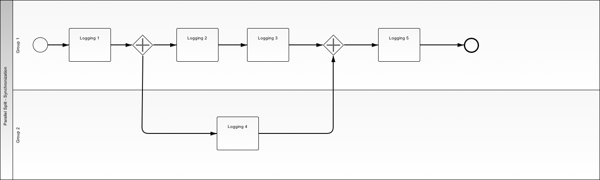

.. _parallel-split-synchronization2:

================================
Parallel Split / Synchronization
================================

Use Case
========

A portion of the workflow must be completed by a different user. Work by
original user can continue while awaiting completion by the second user.

Workflow stops at the merge point until all branches are completed. Once
the merge point has been reached by branches, flow continues.
tasks in that branch. When the merge point is reached, flow continues past
the merge point.

BPMN Diagram
============

Patterns
========

Exclusive Choice Pattern

.. image:: pics/pattern2.png

Synchronization Pattern

.. image:: pics/pattern3.png

Demos
=====

Setup
~~~~~

* http://localhost:8000/client/1/parallel_split_synchronization

Procedure
~~~~~~~~~

Client 1 Completes Tasks First
----------------------------

* Client 1

    - Logging Task 1: Hello
    - Logging Task 2: World
    - Logging Task 3: War Three

* Client 2

    - Logging Task 4: Zombie

* Client 1

    - Logging Task 5: Food
    - Submit

Client 2 Completes Task First
----------------------------

* Client 1

    - Logging Task 1: Hello

* Client 2

    - Logging Task 4: World

* Client 1

    - Logging Task 2: War Three
    - Logging Task 3: Zombie
    - Logging Task 5: Food
    - Submit

Client 2 Completes Task between Client 1 Tasks
------------------------------------------

* Client 1

    - Logging Task 1: Hello
    - Logging Task 2: World

* Client 2

    - Logging Task 4: War Three

* Client 1

    - Logging Task 3: Zombie
    - Logging Task 5: Food

Next Demo
=========

* :ref:`sequence`
