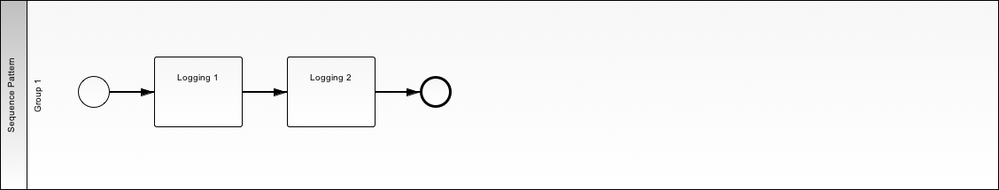
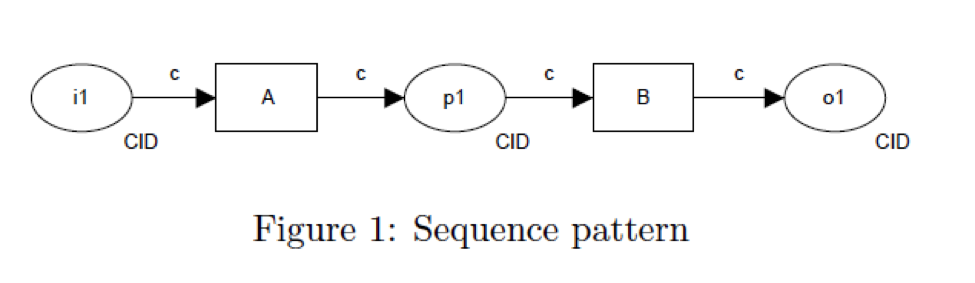

.. _sequence:

================
Sequence Pattern
================

Use Case
========

Require a user to complete a set of tasks in order

BPMN Diagram
============

Pattern
=======

Sequence Pattern

Demo
====

* Logging Task 1: Hello
* Logging Task 2: World

Next Demo
=========

* :ref:`parallel-split-synchronization`
